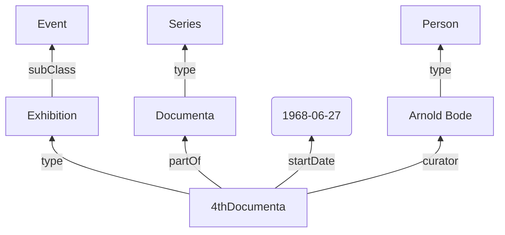
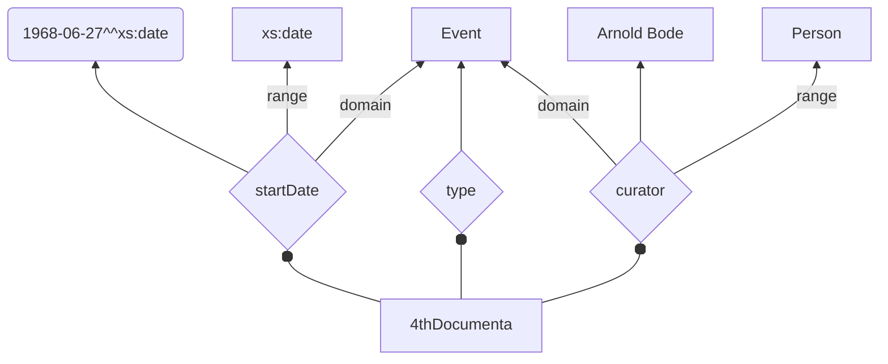
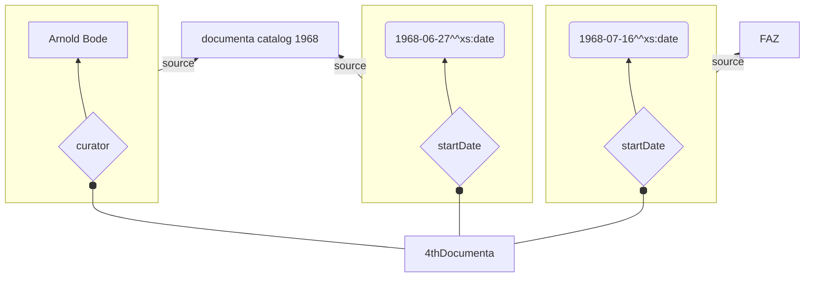
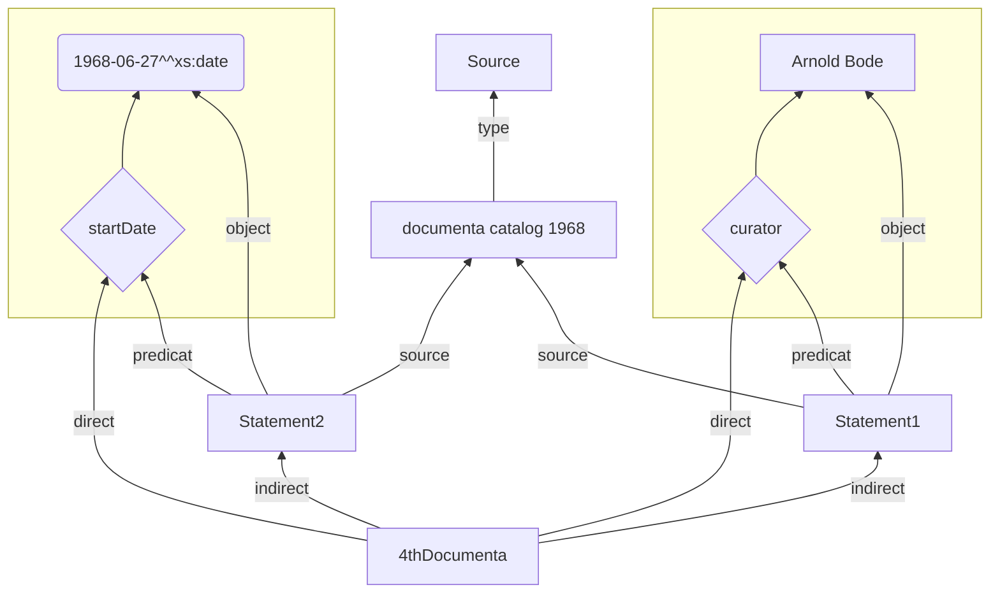
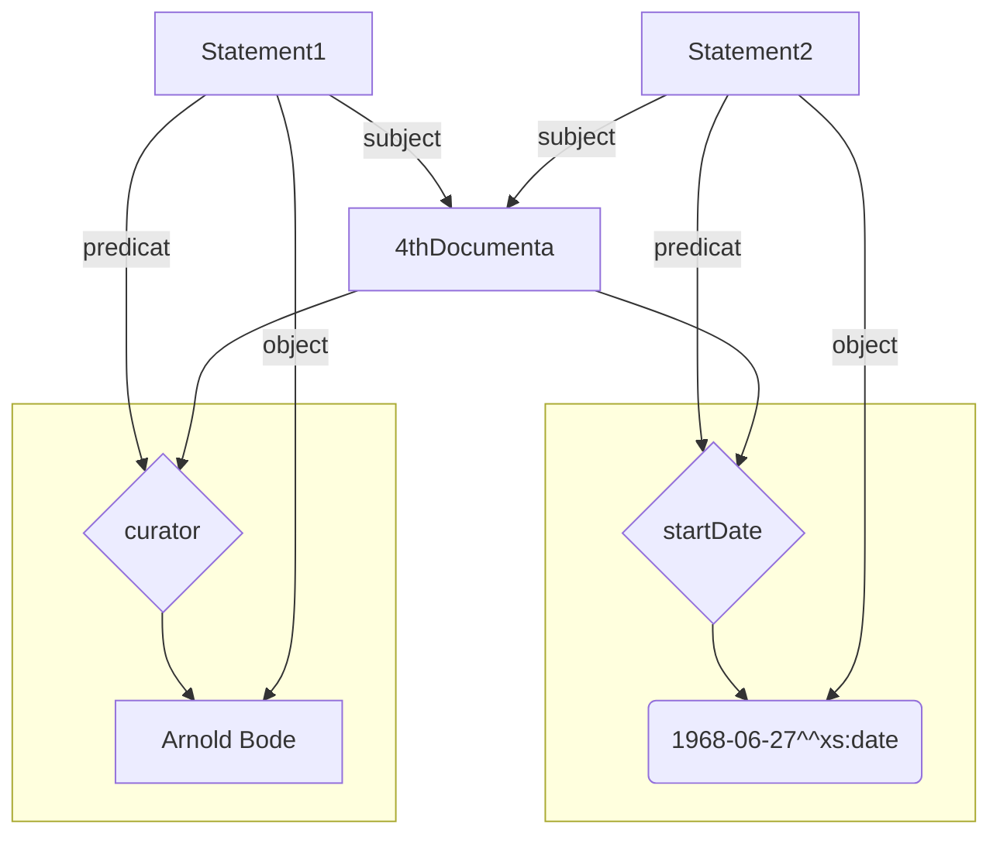
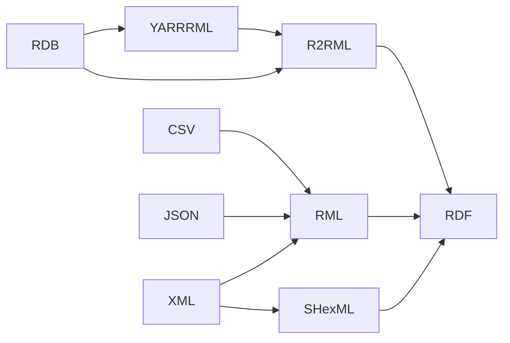

<style>
    code {
        font-size: 0.6em !important;
    }
    table {
        font-size: 20pt;
    }
    
    .small_table table {
        font-size: 14pt;
    }
    
    pre.mermaid {
        box-shadow: none; 
    }
</style>


------
# <span style="color:#3070b3"> Semantic Data für Datenkataloge </span>

### Eine Einführung

##### 15.12.2022 @Sebastian Tilsch

------

---

## Inhalt

Was ist Linked Semantic Data?
Vorstellung einiger Hilfsmittel.
Beispiele
Diskussion

---

## Homage an Tim Berners-Lee


----

https://5stardata.info/de/
<!-- .slide: data-background="https://raw.githubusercontent.com/bastiion/it-forum-2022-semantic-data/main/assets/5-star-website.png" data-background-size="contain" -->

---


## Interesse am Semantic Web


----

## Interesse an Linked Open Data


---


©https://www.flickr.com/photos/reverendsam/

----


© John F. Sowa - Semantics for Interoperable Systems.

----


![SW_Layer_Cake][nowak_layer_cake]


[nowak_layer_cake]: https://smiy.files.wordpress.com/2011/01/sw_layercake.png "©Benjamin Nowack - Semantic Web Layer Cake"
©Benjamin Nowack - Semantic Web Layer Cake


---


<style>
    .reveal table.rdf_cake {
        border: 0px solid #FFFFFF;
        border-collapse: collapse; 
        margin: 0 auto;  
        padding: 0px;
        table-layout: fixed;
        height:100%;
        font-size: 14pt;
    }
    .reveal table.rdf_cake span.sub {
        font-size: 8pt;
    }
    
    table .theIcon {
    	position: absolute;
    	bottom: 0;
    	right: 0;
    }
   
    .reveal table.rdf_cake td{
        padding: 4px;
        border: 8px solid #FFFFFF;
        text-align: center;
    }
    .reveal table.rdf_cake tr{
        text-align: center;
    }
    .reveal table td > div {
        box-shadow: rgba(1,1,1,0.5) 3px 3px 3px;
        height: 100%;
        position: relative;
        display: flex;
        flex-direction: column;
        justify-content: center;

    }
 .all .trust > div, .current.trust > div {
  background-color: #FEB2FE; }

.all .proof, .current.proof {
  background-chcolor: #2DFFFF; }

.all .transmission > div, .current.transmission > div {
  background-color: #FFD1FE; }

.all .vocab > div, .current.vocab > div {
  background-color: #FDBE2D; }

.all .logic > div, .current.logic > div {
  background-color: #A4FEA4; }

.all .rules > div, .current.rules > div {
  background-color: #FFFE38; }

.all .query > div, .current.query > div {
  background-color: #AEB9E3; }

.all .proof > div, .current.proof > div {
  background-color: #AEB9E3; }

.all .serialization > div, .current.serialization > div {
  background-color: #AEB9E3; }

.all .spi > div, .current.spi > div {
  background-color: #FC7322; }

.all .abstract > div, .current.abstract > div {
  background-color: #FEB0A4; }


</style>
<table class='rdf_cake all'>

<tr>
	<td rowspan='1' colspan='8' ><div>
         Apps &amp; Services &amp; APIs
        </div>
    </td>
</tr>
<tr>
	<td></td>
	<td></td>
	<td></td>
	<td></td>
    <td rowspan='1' colspan='4' class='trust'><div>Trust</div></td>
</tr>
<tr>
	<td></td>
	<td></td>
	<td></td>
	<td></td>
	<td></td>
	<td  rowspan='1' colspan='2' class='proof'><div>
        Proof
        </div>
    </td>
	<td rowspan='5' colspan='1' class='transmission' >
       <div>
         Transmission <br/>Security, Crypto  
        </div> 
    </td>
</tr>
<tr>
	<td></td>
	<td></td>
	<td></td>
	<td></td>
	<td rowspan='1' colspan='3' class='logic' ><div>
        Logik
        </div>
    </td>
</tr>
<tr>
	<td></td>
    <td></td>
	<td></td>
	<td rowspan='1' colspan='2' class='rules' ><div>
        Regeln
        </div></td>
	<td rowspan='2' colspan='2' class='vocab'><div>Vokabularien<br/>Ontologien</div></td>
</tr>
<tr>
	<td></td>
	<td></td>
	<td rowspan='1' colspan='3' class='query' ><div>
        Abfrage
        </div></td>
</tr>
<tr>
	<td></td>
	<td></td>
    <td rowspan='1' colspan='5' class='abstract' ><div>
        Grundlagen<br/><span class='sub'>Subjekt-Prädikat-Objekt</span>
        </div></td>
</tr>
<tr>
	<td></td>
    <td rowspan='1' colspan='7' class='spi'><div>
        Resource Identifiers</br><span class='sub '>URIs, IRIs, Namenräume</span>
        </div></td>
</tr>
<tr>
	<td rowspan='1' colspan='8' class='serialization'>
        <div>
            Serialisierungen<br/><span class='sub'>NQuads, NTriples, Turtle, RDF-XML, OWL-XML, Manchester</span>
        </div>
    </td>
</tr>
<tr>
	<td rowspan='1' colspan='8' class='semantic_web'>
        <div>
        Semantic web of linked data
        </div>
    </td>
</tr>
</table>

<!-- .slide: data-transition="zoom" -->


----

## Resource Identifier - IRIs

```rdf
@prefix rdf: <http://www.w3.org/1999/02/22-rdf-syntax-ns#> .
@prefix rdfs: <http://www.w3.org/2000/01/rdf-schema#> .
@prefix foaf: <http://xmlns.com/foaf/0.1/> .
@prefix xs: <http://www.w3.org/2001/XMLSchema#> .
@prefix : <http://ontology.slub-dresden.de/draft/events#> .
@prefix event: <https://w3id.org/arco/ontology/cultural-event/> .
@prefix time: <http://www.w3.org/2006/time#> .
@prefix dct: <http://purl.org/dc/terms/> .
```

`xs:string` - `http://www.w3.org/2001/XMLSchema#string`
`:performance` - `http://ontology.slub-dresden.de/draft/events#performance`
`rdf:type` - `http://www.w3.org/1999/02/22-rdf-syntax-ns#type`

----

### Grundlagen

* benannte Knoten (Namend Nodes) - referenzierbar über IRI
* unbenannte Knoten (Blank Nodes) - nur im Kontext referenzierbar
* Literale
    * Plain Literal (optional Language Tag)
    * Datatype Literal


----

### Triple


| Subjekt                          | Prädikat   | Objekt                                                                |   |   |   |   |   |   |   |
|----------------------------------|------------|-----------------------------------------------------------------------|---|---|---|---|---|---|---|
| Documenta                        | ist eine   | Kunstausstellung                                                      |   |   |   |   |   |   |   |
| 	https://d-nb.info/gnd/1015707-4 | rdf:type   |  [https://d-nb.info/standards/ elementset/gnd #SeriesOfConferenceOrEvent](https://d-nb.info/standards/elementset/gnd#SeriesOfConferenceOrEvent) |   |   |   |   |   |   |   |
| :Documenta                       | rdf:type   | :Exhibition                                                           |   |   |   |   |   |   |   |
| :Exhibition                       | rdf:type   | rdf:Class                                                           |   |   |   |   |   |   |   |
| :Documenta                       | rdfs:label | "Documenta"@de                                                        |   |   |   |   |   |   |   |
| :Documenta                       | rdfs:label | "Документа"@ru   


----


http://intro2libsys.info/atla-2016/linked-data-intro

----

### Quad

Triple mit Graph-IRI

| Subjekt    | Prädikat   | Objekt         | Graph    |
|------------|------------|----------------|----------|
| :Documenta | rdf:type   | :Exhibition    | DEFAULT  |
| :Documenta | rdfs:label | "Documenta"@de | :german  |
| :Documenta | rdfs:label | "Документа"@ru | :russian |

----

<!-- .slide: data-transition="fade"  data-transition-speed="slow" -->



----

<!-- .slide: data-transition="fade"  data-transition-speed="slow" -->



---


<table class='rdf_cake'>

<tr>
	<td rowspan='1' colspan='8' ><div>
         Apps &amp; Services &amp; APIs
        </div>
    </td>
</tr>
<tr>
	<td></td>
	<td></td>
	<td></td>
	<td></td>
    <td rowspan='1' colspan='4' class='trust'><div>Trust</div></td>
</tr>
<tr>
	<td></td>
	<td></td>
	<td></td>
	<td></td>
	<td></td>
	<td  rowspan='1' colspan='2' class='proof'><div>
        Proof
        </div>
    </td>
	<td rowspan='5' colspan='1' class='transmission' >
       <div>
         Transmission <br/>Security, Crypto  
        </div> 
    </td>
</tr>
<tr>
	<td></td>
	<td></td>
	<td></td>
	<td></td>
	<td rowspan='1' colspan='3' class='logic' ><div>
        Logik
        </div>
    </td>
</tr>
<tr>
	<td></td>
    <td></td>
	<td></td>
	<td rowspan='1' colspan='2' class='rules' ><div>
        Regeln
        </div></td>
	<td rowspan='2' colspan='2' class='vocab'><div>Vokabularien<br/>Ontologien</div></td>
</tr>
<tr>
	<td></td>
	<td></td>
	<td rowspan='1' colspan='3' class='query' ><div>
        Abfrage
        </div></td>
</tr>
<tr>
	<td></td>
	<td></td>
    <td rowspan='1' colspan='5' class='abstract' ><div>
        Grundlagen<br/><span class='sub'>Subjekt-Prädikat-Objekt</span>
        </div></td>
</tr>
<tr>
	<td></td>
    <td rowspan='1' colspan='7' class='spi'><div>
        Resource Identifiers</br><span class='sub '>URIs, IRIs, Namenräume</span>
        </div></td>
</tr>
<tr>
	<td rowspan='1' colspan='8' class='serialization current'>
        <div>
            Serialisierungen<br/><span class='sub'>NQuads, NTriples, Turtle, RDF-XML, OWL-XML, Manchester</span>
        </div>
    </td>
</tr>
<tr>
	<td rowspan='1' colspan='8' class='semantic_web'>
        <div>
        Semantic web of linked data
        </div>
    </td>
</tr>
</table>

<!-- .slide: data-transition="zoom" -->


----

<div class='small_table'>

| Format  | Description | Mime-type |
| :--- | :--- | :---: |
| [Turtle](https://www.w3.org/TR/turtle/) | Terse RDF Triple Language. | `text/turtle`, `application/x-turtle` |
| [TriG](https://www.w3.org/TR/trig/) | Plain text format for serializing named graphs and RDF Datasets. | `application/trig`, `application/x-trig` |
| [JSON-LD](https://json-ld.org/) | JSON-based Serialization for Linked Data. | `application/ld+json` |
| [RDF/JSON](https://www.w3.org/TR/rdf-json/) | RDF 1.1 JSON Alternate Serialization. | `application/rdf+json` |
| [N-Triples](https://www.w3.org/TR/n-triples/) | Line-based syntax for RDF datasets. |  `application/n-triples` |
| [N-Quads](https://www.w3.org/TR/n-quads/) | Line-based syntax for RDF datasets. | `application/n-quads`, `text/x-nquads`, `text/nquads` |
| [Notation3](https://www.w3.org/TeamSubmission/n3/) | Notation3 (N3): A readable RDF syntax. | `text/n3`, `text/rdf+n3` |
| [RDF/XML](https://www.w3.org/TR/REC-rdf-syntax/) | RDF/XML Syntax Specification. | `application/rdf+xml`, `application/xml` |
| [TriX](http://www.hpl.hp.com/techreports/2004/HPL-2004-56.html) | RDF Triples in XML. | `application/trix` |
| [HDT](https://www.w3.org/Submission/2011/03/) | Binary RDF Representation for Publication and Exchange. | `application/x-binary-rdf` |
| [aREF](https://gbv.github.io/aREF/aREF.html) | Another RDF Encoding Form. | |
| [RDF/POST](https://atomgraph.github.io/RDF-POST/) | RDF/POST Encoding for RDF. | `application/rdf+x-www-form-urlencoded` |
| [YARRML](http://rml.io/yarrrml/spec/) | YARRRML is a human readable text-based representation for declarative generation rules. It is a subset of [YAML], a widely used data serialization language designed to be  | | human-friendly. | |
| [hextuples](https://github.com/ontola/hextuples) | NDJSON serialization | |

</div>

----


## Turtle

```turtle
@prefix rdf: <http://www.w3.org/1999/02/22-rdf-syntax-ns#> .
@prefix rdfs: <http://www.w3.org/2000/01/rdf-schema#> .
@prefix foaf: <http://xmlns.com/foaf/0.1/> .
@prefix xs: <http://www.w3.org/2001/XMLSchema#> .
@prefix : <http://ontology.slub-dresden.de/draft/events#> .

:Exhibition a rdfs:Class ;
    rdfs:label "Exhibition"@en ;
    rdfs:subClassOf :Event .
:4thDocumenta a :Exhibition ;
    :partOf :Documenta ;
    :startDate "1968-06-27"^^xs:date ;
    :curator :ArnoldBode .
:ArnoldBode a foaf:Person ;
    rdfs:label "Arnold Bode" .
```


----


## JSON-LD

```json
{
  "@context": {
    "sev": "http://ontology.slub-dresden.de/draft/events#",
    "rdf": "http://www.w3.org/1999/02/22-rdf-syntax-ns#",
    "rdfs": "http://www.w3.org/2000/01/rdf-schema#",
    "foaf": "http://xmlns.com/foaf/0.1/",
    "xs": "http://www.w3.org/2001/XMLSchema#"
  },
  "@graph": [
    {
      "@id": "sev:Exhibition",
      "@type": "rdfs:Class",
      "rdfs:label": {
        "@value": "Exhibition",
        "@language": "en"
      },
      "rdfs:subClassOf": {
        "@id": "sev:Event"
      }
    },
    {
      "@id": "sev:4thDocumenta",
      "@type": "sev:Exhibition",
      "sev:partOf": {
        "@id": "sev:Documenta"
      },
      "sev:startDate": {
        "@value": "1968-06-27",
        "@type": "xs:date"
      },
      "sev:curator": {
        "@id": "sev:ArnoldBode"
      }
    },
    {
      "@id": "sev:ArnoldBode",
      "@type": "foaf:Person",
      "rdfs:label": "Arnold Bode"
    }
  ]
}

```
 

----


## RDF XML

```xml
<?xml version="1.0" encoding="utf-8" ?>
<rdf:RDF xmlns:rdf="http://www.w3.org/1999/02/22-rdf-syntax-ns#"
         xmlns:rdfs="http://www.w3.org/2000/01/rdf-schema#"
         xmlns="http://ontology.slub-dresden.de/draft/events#"
         xmlns:foaf="http://xmlns.com/foaf/0.1/">

  <rdfs:Class rdf:about="http://ontology.slub-dresden.de/draft/events#Exhibition">
    <rdfs:label xml:lang="en">Exhibition</rdfs:label>
    <rdfs:subClassOf rdf:resource="http://ontology.slub-dresden.de/draft/events#Event"/>
  </rdfs:Class>

  <rdf:Description rdf:about="http://ontology.slub-dresden.de/draft/events#4thDocumenta">
    <rdf:type rdf:resource="http://ontology.slub-dresden.de/draft/events#Exhibition"/>
    <partOf rdf:resource="http://ontology.slub-dresden.de/draft/events#Documenta"/>
    <startDate rdf:datatype="http://www.w3.org/2001/XMLSchema#date">1968-06-27</startDate>
    <curator>
      <foaf:Person rdf:about="http://ontology.slub-dresden.de/draft/events#ArnoldBode">
        <rdfs:label>Arnold Bode</rdfs:label>
      </foaf:Person>
    </curator>

  </rdf:Description>

</rdf:RDF>
```


---

<table class='rdf_cake'>

<tr>
	<td rowspan='1' colspan='8' ><div>
         Apps &amp; Services &amp; APIs
        </div>
    </td>
</tr>
<tr>
	<td></td>
	<td></td>
	<td></td>
	<td></td>
    <td rowspan='1' colspan='4' class='trust'><div>Trust</div></td>
</tr>
<tr>
	<td></td>
	<td></td>
	<td></td>
	<td></td>
	<td></td>
	<td  rowspan='1' colspan='2' class='proof'><div>
        Proof
        </div>
    </td>
	<td rowspan='5' colspan='1' class='transmission' >
       <div>
         Transmission <br/>Security, Crypto  
        </div> 
    </td>
</tr>
<tr>
	<td></td>
	<td></td>
	<td></td>
	<td></td>
	<td rowspan='1' colspan='3' class='logic' ><div>
        Logik
        </div>
    </td>
</tr>
<tr>
	<td></td>
    <td></td>
	<td></td>
	<td rowspan='1' colspan='2' class='rules' ><div>
        Regeln
        </div></td>
	<td rowspan='2' colspan='2' class='vocab'><div>Vokabularien<br/>Ontologien</div></td>
</tr>
<tr>
	<td></td>
	<td></td>
	<td rowspan='1' colspan='3' class='query' ><div>
        Abfrage
        </div></td>
</tr>
<tr>
	<td></td>
	<td></td>
    <td rowspan='1' colspan='5' class='current abstract' ><div>
        Grundlagen<br/><span class='sub'>Subjekt-Prädikat-Objekt</span>
        </div></td>
</tr>
<tr>
	<td></td>
    <td rowspan='1' colspan='7' class='spi'><div>
        Resource Identifiers</br><span class='sub '>URIs, IRIs, Namenräume</span>
        </div></td>
</tr>
<tr>
	<td rowspan='1' colspan='8' class='serialization'>
        <div>
            Serialisierungen<br/><span class='sub'>NQuads, NTriples, Turtle, RDF-XML, OWL-XML, Manchester</span>
        </div>
    </td>
</tr>
<tr>
	<td rowspan='1' colspan='8' class='semantic_web'>
        <div>
        Semantic web of linked data
        </div>
    </td>
</tr>
</table>

<!-- .slide: data-transition="zoom" -->


----

## Reification, Qualifier,...

Aussagen über Aussagen treffen
Statements about Triple

----

<!-- .slide: data-transition="fade"  data-transition-speed="slow" -->


----

<!-- .slide: data-transition="fade" data-transition-speed="slow" -->




----


```turtle
@prefix rdf: <http://www.w3.org/1999/02/22-rdf-syntax-ns#> .
@prefix rdfs: <http://www.w3.org/2000/01/rdf-schema#> .
@prefix foaf: <http://xmlns.com/foaf/0.1/> .
@prefix xs: <http://www.w3.org/2001/XMLSchema#> .
@prefix : <http://ontology.slub-dresden.de/draft/events#> .

:4thDocumenta a :Exhibition ;
    :partOf :Documenta ;
    :startDate "1968-06-27"^^xs:date ;
    :curator :ArnoldBode .
    
_:st1 a rdfs:Statement ;
   rdf:subject :4thDocumenta ;
   rdf:predicate :startDate ;
   rdf:object "1968-06-27"^^xs:date ;
   :source :DocumentaCatalog1968 .
   
:DocumentaCatalog1968 a :Source .
```


----


<!-- .slide: data-transition="fade"  data-transition-speed="slow" -->



----

<!-- .slide: data-transition="fade"  data-transition-speed="slow" -->



---


<table class='rdf_cake'>

<tr>
	<td rowspan='1' colspan='8' ><div>
         Apps &amp; Services &amp; APIs
        </div>
    </td>
</tr>
<tr>
	<td></td>
	<td></td>
	<td></td>
	<td></td>
    <td rowspan='1' colspan='4' class='trust'><div>Trust</div></td>
</tr>
<tr>
	<td></td>
	<td></td>
	<td></td>
	<td></td>
	<td></td>
	<td  rowspan='1' colspan='2' class='proof'><div>
        Proof
        </div>
    </td>
	<td rowspan='5' colspan='1' class='transmission' >
       <div>
         Transmission <br/>Security, Crypto  
        </div> 
    </td>
</tr>
<tr>
	<td></td>
	<td></td>
	<td></td>
	<td></td>
	<td rowspan='1' colspan='3' class='logic' ><div>
        Logik
        </div>
    </td>
</tr>
<tr>
	<td></td>
    <td></td>
	<td></td>
	<td rowspan='1' colspan='2' class='rules' ><div>
        Regeln
        </div></td>
	<td rowspan='2' colspan='2' class='current vocab'><div>Vokabularien<br/>Ontologien</div></td>
</tr>
<tr>
	<td></td>
	<td></td>
	<td rowspan='1' colspan='3' class='query' ><div>
        Abfrage
        </div></td>
</tr>
<tr>
	<td></td>
	<td></td>
    <td rowspan='1' colspan='5' class='abstract' ><div>
        Grundlagen<br/><span class='sub'>Subjekt-Prädikat-Objekt</span>
        </div></td>
</tr>
<tr>
	<td></td>
    <td rowspan='1' colspan='7' class='spi'><div>
        Resource Identifiers</br><span class='sub '>URIs, IRIs, Namenräume</span>
        </div></td>
</tr>
<tr>
	<td rowspan='1' colspan='8' class='serialization'>
        <div>
            Serialisierungen<br/><span class='sub'>NQuads, NTriples, Turtle, RDF-XML, OWL-XML, Manchester</span>
        </div>
    </td>
</tr>
<tr>
	<td rowspan='1' colspan='8' class='semantic_web'>
        <div>
        Semantic web of linked data
        </div>
    </td>
</tr>
</table>

<!-- .slide: data-transition="zoom" -->


----


## [LOV](https://lov.linkeddata.es/dataset/lov)

<!-- .slide: data-background="https://raw.githubusercontent.com/bastiion/it-forum-2022-semantic-data/main/assets/LOD-catalog.png" data-background-size="contain" -->


----

### Basis

[rdf](http://www.w3.org/1999/02/22-rdf-syntax-ns#), [rdfs](http://www.w3.org/2000/01/rdf-schema#), [(xsd)](http://www.w3.org/2001/XMLSchema)

### Domainspezifisch

schema.org, [dcterms](http://purl.org/dc/terms/), [dce](http://purl.org/dc/elements/1.1/), [foaf](http://xmlns.com/foaf/0.1/), [GND](http://d-nb.info/standards/elementset/gnd#), [SKOS](http://www.w3.org/2004/02/skos/core)

### Logic

[OWL](http://www.w3.org/2002/07/owl), [SWRL](http://www.w3.org/2003/11/swrl)

### Constraints

[SHACL](http://www.w3.org/ns/shacl#), [SHeX](https://shex.io/shex-primer/)


----

### weitere Korpora

[dbpedia](https://www.dbpedia.org/resources/ontology/)
[Wikidata](https://www.wikidata.org/wiki/Wikidata:Main_Page)
[Eurpeana](https://pro.europeana.eu/page/sparql#examples)


---


<table class='rdf_cake'>

<tr>
	<td rowspan='1' colspan='8' ><div>
         Apps &amp; Services &amp; APIs
        </div>
    </td>
</tr>
<tr>
	<td></td>
	<td></td>
	<td></td>
	<td></td>
    <td rowspan='1' colspan='4' class='trust'><div>Trust</div></td>
</tr>
<tr>
	<td></td>
	<td></td>
	<td></td>
	<td></td>
	<td></td>
	<td  rowspan='1' colspan='2' class='proof'><div>
        Proof
        </div>
    </td>
	<td rowspan='5' colspan='1' class='transmission' >
       <div>
         Transmission <br/>Security, Crypto  
        </div> 
    </td>
</tr>
<tr>
	<td></td>
	<td></td>
	<td></td>
	<td></td>
	<td rowspan='1' colspan='3' class='logic' ><div>
        Logik
        </div>
    </td>
</tr>
<tr>
	<td></td>
    <td></td>
	<td></td>
	<td rowspan='1' colspan='2' class='rules' ><div>
        Regeln
        </div></td>
	<td rowspan='2' colspan='2' class='vocab'><div>Vokabularien<br/>Ontologien</div></td>
</tr>
<tr>
	<td></td>
	<td></td>
	<td rowspan='1' colspan='3' class='current query' ><div>
        Abfrage
        </div></td>
</tr>
<tr>
	<td></td>
	<td></td>
    <td rowspan='1' colspan='5' class='abstract' ><div>
        Grundlagen<br/><span class='sub'>Subjekt-Prädikat-Objekt</span>
        </div></td>
</tr>
<tr>
	<td></td>
    <td rowspan='1' colspan='7' class='spi'><div>
        Resource Identifiers</br><span class='sub '>URIs, IRIs, Namenräume</span>
        </div></td>
</tr>
<tr>
	<td rowspan='1' colspan='8' class='serialization'>
        <div>
            Serialisierungen<br/><span class='sub'>NQuads, NTriples, Turtle, RDF-XML, OWL-XML, Manchester</span>
        </div>
    </td>
</tr>
<tr>
	<td rowspan='1' colspan='8' class='semantic_web'>
        <div>
        Semantic web of linked data
        </div>
    </td>
</tr>
</table>

<!-- .slide: data-transition="zoom" -->


----


## SPARQL Queries


### Abfrage

- ASK - wahr oder falsch?
- SELECT - tabellarische Ausgabe
- CONSTRUCT - neuer Graph/ Subgraph

### Schreiben

- [SPARQL Update](https://www.w3.org/TR/sparql11-update/)


----


## SPARQL

[DBPedia - Alle Oberklassen der Documenta 
](https://dbpedia.org/sparql/?default-graph-uri=http%3A%2F%2Fdbpedia.org&query=PREFIX+rdf%3A++++%3Chttp%3A%2F%2Fwww.w3.org%2F1999%2F02%2F22-rdf-syntax-ns%23%3E%0D%0APREFIX+rdfs%3A+++%3Chttp%3A%2F%2Fwww.w3.org%2F2000%2F01%2Frdf-schema%23%3E%0D%0APREFIX+dbo%3A+%3Chttp%3A%2F%2Fdbpedia.org%2Fontology%2F%3E+%0D%0APREFIX+dbp%3A+%3Chttp%3A%2F%2Fdbpedia.org%2Fproperty%2F%3E%0D%0APREFIX+dbr%3A+%3Chttp%3A%2F%2Fdbpedia.org%2Fresource%2F%3E%0D%0A%0D%0A%0D%0ASELECT+DISTINCT+%3Fclass+%3FclassLabel+WHERE+%7B%0D%0A++dbr%3ADocumenta+rdf%3Atype%2Frdfs%3AsubClassOf*+%3Fclass.+%0D%0A++%3Fclass+rdfs%3Alabel+%3FclassLabel%0D%0A++FILTER%28LANG%28%3FclassLabel%29%3D%22de%22%29%0D%0A%7D+%0D%0ALIMIT+100&format=text%2Fx-html%2Btr&timeout=10000&signal_void=on&signal_unconnected=on)
```SPARQL

SELECT DISTINCT ?class ?classLabel WHERE {
  dbr:Documenta rdf:type/rdfs:subClassOf* ?class . 
  ?class rdfs:label ?classLabel .
  FILTER(LANG(?classLabel)="de")
} LIMIT 100

```


----

[Wikidata - Mögliche Eigenschaften aller Klassen und Oberklassen der Documenta](https://query.wikidata.org/#PREFIX%20schema%3A%20%3Chttp%3A%2F%2Fschema.org%2F%3E%0APREFIX%20rdf%3A%20%3Chttp%3A%2F%2Fwww.w3.org%2F1999%2F02%2F22-rdf-syntax-ns%23%3E%0APREFIX%20rdfs%3A%20%3Chttp%3A%2F%2Fwww.w3.org%2F2000%2F01%2Frdf-schema%23%3E%0APREFIX%20wd%3A%20%3Chttp%3A%2F%2Fwww.wikidata.org%2Fentity%2F%3E%0APREFIX%20wdt%3A%20%3Chttp%3A%2F%2Fwww.wikidata.org%2Fprop%2Fdirect%2F%3E%0APREFIX%20p%3A%20%3Chttp%3A%2F%2Fwww.wikidata.org%2Fprop%2F%3E%0ASELECT%20DISTINCT%20%3FclassLabel%20%3Fprops%20%3FpropsLabel%20%0AWHERE%20%7B%0A%20%20%20%20%20wd%3AQ231289%20wdt%3AP31%2Fwdt%3AP279%2a%20%3Fclass%20.%0A%09%20%3Fclass%20wdt%3AP1963%20%3Fprops%20.%0A%20%20%20%20%20%20FILTER%20NOT%20EXISTS%20%7B%20%0A%20%20%20%20%20%20%20%20%20%20%3Fprops%20wdt%3AP31%2Fwdt%3AP279%2a%20wd%3AQ19847637%20.%20%0A%20%20%20%20%20%20%7D%0A%0A%20%20%20%20%20%20SERVICE%20wikibase%3Alabel%20%7B%20bd%3AserviceParam%20wikibase%3Alanguage%20%22en%22.%20%7D%20%0A%0A%7D%20ORDER%20BY%20%3FclassLabel%20%3FpropsLabel)


```SPARQL

SELECT DISTINCT ?classLabel ?props ?propsLabel 
WHERE {
     wd:Q231289 wdt:P31/wdt:P279* ?class .
	 ?class wdt:P1963 ?props .
     FILTER NOT EXISTS { 
          ?props wdt:P31/wdt:P279* wd:Q19847637 . 
     }
     SERVICE wikibase:label { bd:serviceParam wikibase:language "en". }
} ORDER BY ?classLabel ?propsLabel

```

----

## Hilfsmittel


----

[Künstler\*innen des Expressionismus](https://sparnatural.eu/demos/demo-dbpedia-v2/index.html?lang=en#)

```SPARQL
PREFIX rdf: <http://www.w3.org/1999/02/22-rdf-syntax-ns#>
PREFIX rdfs: <http://www.w3.org/2000/01/rdf-schema#>
PREFIX dbo: <http://dbpedia.org/ontology/> 
SELECT DISTINCT ?Date_3 ?Date_4 ?this ?this_label WHERE {
  ?this rdf:type dbo:Person.
  ?this dbo:movement <http://fr.dbpedia.org/resource/Impressionnisme>.
  ?this dbo:birthDate ?Date_3.
  OPTIONAL { ?this dbo:deathDate ?Date_4. }
  ?this <http://www.w3.org/2000/01/rdf-schema#label> ?this_label.
  FILTER(LANG(?this_label) = "en")
}
LIMIT 1000

```

----

## föderierte (verteilte) Abfragen

<a href="https://sophox.org/#%23%20Find%20Commons%20category%20suggestions%20for%20a%20Commons%20file%20using%20subjects%20stored%20in%20Europeana%0A%23%201.)%20Bind%20identifier%20of%20the%20photo%20to%20variable%0A%23%202.)%20Read%20subjects%20in%20Finnish%20of%20photo%20defined%20by%20identifier%20from%20Europeana%0A%23%203.)%20Translate%20subjects%20to%20YSO%20ontology%20using%20Finto-service.%20%0A%23%204.)%20Translate%20YSO%20items%20to%20Wikidata%20items%20using%20Wikidata%20and%20read%20Commons%20categories%0A%0ASELECT%20*%20WITH%20%7B%0A%20%20SELECT%20*%20WHERE%20%7B%20%20%20%20%20%0A%20%20%20%20%20%23%201.)%20Bind%20identifier%20of%20the%20photo%20to%20variable%0A%20%20%20%20%20BIND(%22HK19700502%3A254%22%20as%20%3Fidentifier)%0A%0A%20%20%20%20%20%23%202.)%20Read%20subjects%20in%20Finnish%20of%20photo%20defined%20by%20identifier%20from%20Europeana%0A%20%20%20%20%20SERVICE%20%3Chttp%3A%2F%2Fsparql.europeana.eu%2F%3E%20%7B%0A%20%20%20%20%20%20%20%3Feuropeana%20%3Chttp%3A%2F%2Fpurl.org%2Fdc%2Felements%2F1.1%2Fidentifier%3E%20%3Fidentifier%20.%0A%20%20%20%20%20%20%20%3Feuropeana%20%3Chttp%3A%2F%2Fpurl.org%2Fdc%2Felements%2F1.1%2Fsubject%3E%20%3Fsubject%20.%20%20%20%20%20%20%20%0A%20%20%20%20%20%7D%0A%20%20%7D%0A%7D%20AS%20%25europeana%0AWHERE%20%7B%0A%20%20INCLUDE%20%25europeana%20.%20%0A%20%20%0A%20%20%23%203.)%20Translate%20subjects%20to%20YSO%20ontology%20using%20Finto-service.%20%0A%20%20SERVICE%20%3Chttp%3A%2F%2Fapi.finto.fi%2Fsparql%3E%20%7B%0A%20%20%20%20%3Fyso%20skos%3AprefLabel%20%3Fsubject%20%3B%0A%20%20%20%20skos%3AinScheme%20%3Chttp%3A%2F%2Fwww.yso.fi%2Fonto%2Fyso%2F%3E%0A%20%20%7D%0A%20%20%20%0A%20%20%23%204.)%20Translate%20YSO%20items%20to%20Wikidata%20items%20using%20Wikidata%20and%20read%20Commons%20categories%0A%20%20BIND(REPLACE(STR(%3Fyso)%2C%20%22http%3A%2F%2Fwww.yso.fi%2Fonto%2Fyso%2Fp%22%2C%20%22%22)%20as%20%3Fyso_number)%0A%20%20SERVICE%20%3Chttps%3A%2F%2Fquery.wikidata.org%2Fsparql%3E%20%20%7B%0A%20%20%20%20%3Fwikidata%20wdt%3AP2347%20%3Fyso_number%20.%0A%20%20%20%20%3Fwikidata%20wdt%3AP373%20%3Fcommonscat%20%20%0A%20%20%7D%0A%7D" target="_blank" >Beispiel verteilte Abfrage</a>

```SPARQL
SELECT * WITH {
  SELECT * WHERE {     
     # 1.) ID eines Fotos an Variable koppeln
     BIND("HK19700502:254" as ?identifier)

     # 2.) Subjekte des Foto aus der Europeana ziehen
     SERVICE <http://sparql.europeana.eu/> {
       ?europeana <http://purl.org/dc/elements/1.1/identifier> ?identifier .
       ?europeana <http://purl.org/dc/elements/1.1/subject> ?subject .       
     }
  }
} AS %europeana
WHERE {
  INCLUDE %europeana . 
  
  # 3.) Übersetze Subject in die YSO Ontologie
  SERVICE <http://api.finto.fi/sparql> {
    ?yso skos:prefLabel ?subject ;
    skos:inScheme <http://www.yso.fi/onto/yso/>
  }
   
  # 4.) YSO Elements in Wikidata suchen und  Commons Kategorie suchen
  BIND(REPLACE(STR(?yso), "http://www.yso.fi/onto/yso/p", "") as ?yso_number)
  SERVICE <https://query.wikidata.org/sparql>  {
    ?wikidata wdt:P2347 ?yso_number .
    ?wikidata wdt:P373 ?commonscat  
  }
}
```

----

## GraphQL

* besonders geeignet als API für Frontend Entwicklung
* [automatisch, teilautomatische](https://github.com/internet-of-production/UltraGraphQL) oder [manuelle](https://github.com/dbcls/grasp) Erstellung aus Ontologie
* Introspection erleicht das Abfragen


----


Showcase...

---


<table class='rdf_cake'>

<tr>
	<td rowspan='1' colspan='8' ><div>
         Apps &amp; Services &amp; APIs
        </div>
    </td>
</tr>
<tr>
	<td></td>
	<td></td>
	<td></td>
	<td></td>
    <td rowspan='1' colspan='4' class='trust'><div>Trust</div></td>
</tr>
<tr>
	<td></td>
	<td></td>
	<td></td>
	<td></td>
	<td></td>
	<td  rowspan='1' colspan='2' class='proof'><div>
        Proof
        </div>
    </td>
	<td rowspan='5' colspan='1' class='transmission' >
       <div>
         Transmission <br/>Security, Crypto  
        </div> 
    </td>
</tr>
<tr>
	<td></td>
	<td></td>
	<td></td>
	<td></td>
	<td rowspan='1' colspan='3' class='logic current' ><div>
        Logik
        </div>
    </td>
</tr>
<tr>
	<td></td>
    <td></td>
	<td></td>
	<td rowspan='1' colspan='2' class='rules' ><div>
        Regeln
        </div></td>
	<td rowspan='2' colspan='2' class='vocab'><div>Vokabularien<br/>Ontologien</div></td>
</tr>
<tr>
	<td></td>
	<td></td>
	<td rowspan='1' colspan='3' class='query' ><div>
        Abfrage
        </div></td>
</tr>
<tr>
	<td></td>
	<td></td>
    <td rowspan='1' colspan='5' class='abstract' ><div>
        Grundlagen<br/><span class='sub'>Subjekt-Prädikat-Objekt</span>
        </div></td>
</tr>
<tr>
	<td></td>
    <td rowspan='1' colspan='7' class='spi'><div>
        Resource Identifiers</br><span class='sub '>URIs, IRIs, Namenräume</span>
        </div></td>
</tr>
<tr>
	<td rowspan='1' colspan='8' class='serialization'>
        <div>
            Serialisierungen<br/><span class='sub'>NQuads, NTriples, Turtle, RDF-XML, OWL-XML, Manchester</span>
        </div>
    </td>
</tr>
<tr>
	<td rowspan='1' colspan='8' class='semantic_web'>
        <div>
        Semantic web of linked data
        </div>
    </td>
</tr>
</table>

<!-- .slide: data-transition="zoom" -->


----


## Logik

* Prolog
* Web Ontology Language  (OWL2)
* Semantic Web Rule Language ([SWRL](https://www.w3.org/Submission/SWRL/))
* SPARQL Inference Notation ([SPIN](https://spinrdf.org/))

----


* OWL2 (DL) basiert auf Beschreibungslogik SROIQ, sehr ausdrucksstrake Beschreibungssprache, Schlussfolgern rechenintensiv
* OWL2-EL basiert auf EL++,  TBox (polynomielle Zeit  für die meisten Inference Tasks wie Klassifikation).
* OWL2-QL basiert auf DL-Lite, richtet sich an schnelle Abfrageantwort mittels ABox (viele Daten aber simple TBox).
* OWL2-RL basiert auf Description Logic Programs (DLP), Untermenge von OWL2 DL.


----


## OWL

Ausdrucksstarke Beschreibunslogik
Eigene Serialisierungen wie

* Manchester Syntax
* Functional Syntax
* OWL/XML
* aus natürlicher Sprache (Attempto Controlled English)

----


<div class='small_table'>

| OWL                                                                                                                                           | Deutsch                                                                     | ACE                                               |
|-----------------------------------------------------------------------------------------------------------------------------------------------|-----------------------------------------------------------------------------|---------------------------------------------------|
| SubClassOf( SomeValuesFrom( a:curates a:Exhibition ) a:Curator )                                                                              | Jeder der eine Ausstellung kuratiert hat ist ein Kurator.                   | Everybody who curates an Exhibition is a Curator. |
| SubClassOf( SomeValuesFrom( a:hasAge DatatypeRestriction( xsd:integer minInclusive 13^^xsd:integer maxInclusive 19^^xsd:integer)) a:Teenager) | Teenager ist, wer älter/gleich 13 und jünger/gleich 19 ist.                 |                                                   |
| SubClassOf( SomeValuesFrom( a:hasChild a:Person ) a:Parent )                                                                                  | Jeder, der ein Kind vom Typ Person hat ist ein Elternteil.                  | Everybody whose child is a child is a parent.     |
| SymmetricProperty( a:friend )	                                                                                                                | Die Eigenschaft "ist Freund von" ist symmetrisch                            | 	If X is a friend of Y then Y is a friend of X.   |
| AsymmetricProperty( a:parentOf )                                                                                                              | Die Eigenschaft "ist Elternteil" ist asymmetrisch                           |                                                   |
| EquivalentClasses( a:ArtExhibition SomeValuesFrom( a:hasSubject a:Artwork ) )                                                                 | Kunstausstellung ist eine Austellung deren Subjekt Kunstwerke sind          |                                                   |
| DisjointClasses( a:RegularEvent a:OneTimeEvent )	                                                                                             | Nichts ist gleicheitig ein Einzelereignis und ein wiederkehrendes Ereignis. | No OneTimeEvent is a RegularEvent.               | 


</div>


---


<table class='rdf_cake'>

<tr>
	<td rowspan='1' colspan='8' ><div>
         Apps &amp; Services &amp; APIs
        </div>
    </td>
</tr>
<tr>
	<td></td>
	<td></td>
	<td></td>
	<td></td>
    <td rowspan='1' colspan='4' class='trust'><div>Trust</div></td>
</tr>
<tr>
	<td></td>
	<td></td>
	<td></td>
	<td></td>
	<td></td>
	<td  rowspan='1' colspan='2' class='proof'><div>
        Proof
        </div>
    </td>
	<td rowspan='5' colspan='1' class='transmission' >
       <div>
         Transmission <br/>Security, Crypto  
        </div> 
    </td>
</tr>
<tr>
	<td></td>
	<td></td>
	<td></td>
	<td></td>
	<td rowspan='1' colspan='3' class='logic' ><div>
        Logik
        </div>
    </td>
</tr>
<tr>
	<td></td>
    <td></td>
	<td></td>
	<td rowspan='1' colspan='2' class='rules current' ><div>
        Regeln
        </div></td>
	<td rowspan='2' colspan='2' class='vocab'><div>Vokabularien<br/>Ontologien</div></td>
</tr>
<tr>
	<td></td>
	<td></td>
	<td rowspan='1' colspan='3' class='query' ><div>
        Abfrage
        </div></td>
</tr>
<tr>
	<td></td>
	<td></td>
    <td rowspan='1' colspan='5' class='abstract' ><div>
        Grundlagen<br/><span class='sub'>Subjekt-Prädikat-Objekt</span>
        </div></td>
</tr>
<tr>
	<td></td>
    <td rowspan='1' colspan='7' class='spi'><div>
        Resource Identifiers</br><span class='sub '>URIs, IRIs, Namenräume</span>
        </div></td>
</tr>
<tr>
	<td rowspan='1' colspan='8' class='serialization'>
        <div>
            Serialisierungen<br/><span class='sub'>NQuads, NTriples, Turtle, RDF-XML, OWL-XML, Manchester</span>
        </div>
    </td>
</tr>
<tr>
	<td rowspan='1' colspan='8' class='semantic_web'>
        <div>
        Semantic web of linked data
        </div>
    </td>
</tr>
</table>

<!-- .slide: data-transition="zoom" -->


----

## Regeln, Validierung

Open World vs Closed World
* Validierung
* UI Generierung
* Datenqualität wahren


----


----

[SHACL Shape Constraint Language](https://www.w3.org/TR/shacl/)

[SHeX Shape Expression](https://shex.io/)

vergleichbar mit [JSON-Schema](http://json-schema.org/), RelaxNG, XSD,...

----

https://forms.hypermedia.app/playground/
https://shacl-playground.zazuko.com/
[SHeX Validator](https://rdfshape.weso.es/shexValidate)


---

## Mappings - ETL



---

## [Semantic Web in Bibliotheken](https://swib.org/swib22/programme.html)

### Vorschläge

* Verwendung etablierter, teils Programmiersprachen- und Datenbank-unabhängiger und  Schemabeschreibungssprachen
* RDF als inermediäres Austauschformat
    * in ETL Pipelines
    * für Export und Backup
* SPARQL Endpunkte bereitstellen
* GraphQL Schnittstellen bereistellen
* interner öffentlicher Katalog an Vokabularien
* versionierte Datenmodelle
* [FAIR](https://forschungsdaten.info/themen/veroeffentlichen-und-archivieren/faire-daten/) Policy mit 5-star LOD kombinieren

----

### Vorschläge Frontend

* Komponntenbasierte semantische Frontendentwicklung
* deklarative Formulare
* deklarative Tabellen
* Entkopplung von Backend und Frontend
* UI Komponenten Kataloge (siehe Storyboards)
    * React, Vue, Web Components
    * Beschreibung per RDF und Typescript Generierung

----

### erhoffte Vorteile


* bessere Langzeitarchivierung, Nachhaltigkeit
    * RDF Daten können als dump regelmäßig gesichert werden
    * Graphen können beliebig in einzelne Entitäten aufgteilt und serialisiert werden
* besseres Verständnis der Modelle und Datenstrukturen (explorativ)
* Verknüpfbarkeit mit anderen Daten
* Wahrung und Messung von Datenqualität und Wahrheitsgehalt
* aktuelle Forschungsergebnisse einfließen lassen
* Interbibliothekarischen Austausch erleichtern

---

## Live Demos 

https://www.wikidata.org/wiki/Q231289
[https://query.wikidata.org/](https://query.wikidata.org/#PREFIX%20schema%3A%20%3Chttp%3A%2F%2Fschema.org%2F%3E%0APREFIX%20rdf%3A%20%3Chttp%3A%2F%2Fwww.w3.org%2F1999%2F02%2F22-rdf-syntax-ns%23%3E%0APREFIX%20rdfs%3A%20%3Chttp%3A%2F%2Fwww.w3.org%2F2000%2F01%2Frdf-schema%23%3E%0APREFIX%20wd%3A%20%3Chttp%3A%2F%2Fwww.wikidata.org%2Fentity%2F%3E%0APREFIX%20wdt%3A%20%3Chttp%3A%2F%2Fwww.wikidata.org%2Fprop%2Fdirect%2F%3E%0APREFIX%20p%3A%20%3Chttp%3A%2F%2Fwww.wikidata.org%2Fprop%2F%3E%0ASELECT%20DISTINCT%20%3FclassLabel%20%3Fprops%20%3FpropsLabel%20%0AWHERE%20%7B%0A%20%20%20%20%20wd%3AQ231289%20wdt%3AP31%2Fwdt%3AP279%2a%20%3Fclass%20.%0A%09%20%3Fclass%20wdt%3AP1963%20%3Fprops%20.%0A%20%20%20%20%20%20FILTER%20NOT%20EXISTS%20%7B%20%0A%20%20%20%20%20%20%20%20%20%20%3Fprops%20wdt%3AP31%2Fwdt%3AP279%2a%20wd%3AQ19847637%20.%20%0A%20%20%20%20%20%20%7D%0A%0A%20%20%20%20%20%20SERVICE%20wikibase%3Alabel%20%7B%20bd%3AserviceParam%20wikibase%3Alanguage%20%22en%22.%20%7D%20%0A%0A%7D%20ORDER%20BY%20%3FclassLabel%20%3FpropsLabel)
https://angryloki.github.io/wikidata-graph-builder/
Graph Explorer, UltraGraphQL, ...

---

## Fragen, Anregungen, Diskussion

DANKE für die Aufmerksamkeit
